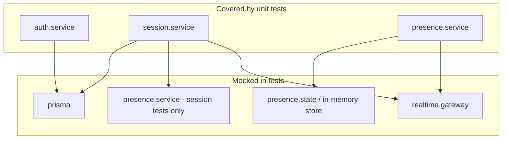

# Unit testing documentation

This document describes how unit tests are set up in the English Learning App monorepo, what they cover today, and what is intentionally out of scope or still missing.

## Summary

| Item | Detail |
|------|--------|
| **Runner** | [Vitest](https://vitest.dev/) v3.x |
| **Package** | `apps/api` only (backend business logic) |
| **Test count** | 36 tests across 3 files (as of last run) |
| **Style** | Unit tests colocated next to `*.service.ts` files |
| **External deps in tests** | None (no Postgres, Redis, or LiveKit required) |

Frontend (`apps/frontend`) and shared packages (`packages/contracts`) do not have Vitest suites yet.

---

## How to run tests

From the repository root:

```bash
# API tests only (recommended during development)
pnpm --filter api test

# Watch mode while editing services
pnpm --filter api test:watch

# Monorepo (Turbo: builds workspace deps first, then runs `test` where defined)
pnpm test
```

Turbo’s `test` task depends on `^build`, so `packages/contracts` is built before API tests when using `pnpm test` at the root.

**Requirements:** Node.js, `pnpm install` (includes `vitest` in `apps/api`). No Docker services needed for unit tests.

---

## Tools and libraries

| Tool | Role |
|------|------|
| **Vitest** | Test runner, assertions, mocking (`vi.mock`, `vi.fn`, `vi.hoisted`, fake timers) |
| **Node environment** | Tests run in Node (not jsdom); matches API runtime |
| **bcryptjs** (real) | Used in auth login tests for one realistic password hash path |
| **jsonwebtoken** (real) | Token sign/verify exercised through `auth.service` |
| **@english-learning/contracts** | Event names and payload shapes used in assertions |

Not used today: coverage reporters (`@vitest/coverage-v8`), E2E frameworks (Playwright), or test databases.

---

## Configuration changes

### `apps/api/package.json`

- **Dev dependencies:** `vitest@^3.2.4`, `vite@^6.2.0` (pins Vite 6; Vitest 3 cannot load Vite 7’s ESM-only config)
- **Scripts:**
  - `test` → `vitest run`
  - `test:watch` → `vitest`

### `apps/api/vitest.config.ts`

- `environment: "node"`
- `include: ["src/**/*.test.ts"]`
- `setupFiles: ["src/test/vitest.setup.ts"]`
- `pool: "forks"` — isolates process state (important for presence disconnect timers)

### `apps/api/src/test/vitest.setup.ts`

Sets defaults before modules load:

- `JWT_SECRET=test-secret`
- `REALTIME_DISCONNECT_TIMEOUT_MS=100` (short timeout for reconnect timer tests)

### `apps/api/tsconfig.json`

Excluded from production `tsc` emit:

- `src/**/*.test.ts`
- `src/**/*.in-memory-store.ts` (test-only in-memory Redis stand-in)

### Root `package.json`

- `"test": "turbo run test"`

### `turbo.json`

- `"test": { "dependsOn": ["^build"] }`

### Lockfile

- `pnpm-lock.yaml` updated when `vitest` was added to `apps/api`.

---

## Files created for testing

### Config and shared utilities

| Path | Purpose |
|------|---------|
| `apps/api/vitest.config.ts` | Vitest project config |
| `apps/api/src/test/vitest.setup.ts` | Global env for JWT and disconnect timeout |
| `apps/api/src/test/helpers.ts` | `teacherUser()`, `studentUser()`, `mockSocket()`, `TEST_ROOM_ID` |

### Test suites (colocated with services)

| Path | Tests | Service under test |
|------|-------|-------------------|
| `apps/api/src/modules/auth/services/auth.service.test.ts` | 7 | `auth.service.ts` |
| `apps/api/src/modules/session/services/session.service.test.ts` | 17 | `session.service.ts` |
| `apps/api/src/modules/realtime/services/presence.service.test.ts` | 12 | `presence.service.ts` |

### Test-only support code

| Path | Purpose |
|------|---------|
| `apps/api/src/modules/realtime/services/presence.in-memory-store.ts` | In-memory implementation of Redis presence keys (room marker, session hash, socket index) |

Convention: **production service tests live in `*.service.test.ts` beside `*.service.ts`**. Shared helpers live under `apps/api/src/test/`.

---

## What we mainly test

Tests focus on **business logic inside `.service.ts` files**, not HTTP routes, Socket.IO wiring, or Redis/Prisma integrations.



### 1. Authorization (`auth.service`)

| Area | Behavior verified |
|------|-------------------|
| Register | Duplicate email rejected; new user returns JWT parseable by `verifyToken` |
| Login | Unknown user and wrong password → `"Invalid credentials"`; success returns valid token |
| `verifyToken` | Tampered token rejected; missing `JWT_SECRET` throws |

HTTP-level auth (`getAuthUser`, `requireRole` in `apps/api/src/lib/require-auth.ts`) and socket middleware (`authenticateSocket`) are **not** unit-tested here.

### 2. Session lifecycle (`session.service`)

| Area | Behavior verified |
|------|-------------------|
| `startSession` | No class → error; ends other `live` sessions; creates `class-{8}` room id; calls `initializePresenceRoom` |
| `joinSession` | No class / no live session errors; returns normalized session DTO |
| `endSession` | Wrong or missing session → `"Cannot end this session"`; updates DB to `ended` |
| `handleJoinSession` | Unauthenticated, invalid payload, or missing presence room → no-op; valid → `joinPresence` |
| `handleLeaveSession` | Same guards; valid → `leavePresence` |
| `handleEndSession` | Students blocked; missing room or failed `endSession` → no terminate; teacher success → DB end + `clearPresenceRoom` + `session_ended` emit + `disconnectRoom` |

Prisma and presence/gateway collaborators are **mocked**; no real database.

### 3. Presence lifecycle (`presence.service`)

| Area | Behavior verified |
|------|-------------------|
| Room | `initializePresenceRoom` / `hasPresenceRoom` |
| Join / leave | Socket room join, online status, `presence_updated` (online/reconnecting only, not offline seeds) |
| `registerParticipants` | Offline seed when room exists; no-op when room missing |
| `clearPresenceRoom` | Clears state; cancels pending disconnect timer |
| Multi-tab | Disconnect one socket while another remains → stays `online` |
| Reconnect | Last socket disconnect → `reconnecting`; after 100ms timeout → removed + `participant_disconnected` |
| Rejoin | `joinPresence` before timer fires cancels removal |
| Guard | Timer does not delete user if sockets were restored before fire |

`presence.state` is replaced by `presence.in-memory-store.ts` in tests. `emitToRoom` is a spy (no real Socket.IO server).

### 4. Room membership and disconnect/reconnect

These concerns are split across **session** (join only if presence room exists; leave/end handlers) and **presence** (socket membership, reconnect timer, multi-tab). Together they document the intended realtime room behavior without integration tests.

---

## Mocking patterns

### Prisma (`auth`, `session`)

```ts
vi.mock("../../../lib/prisma.js", () => ({ prisma: { ... } }));
```

Use `vi.hoisted()` for mock function references so Vitest’s hoisted `vi.mock` factories can access them.

### Session → presence + gateway

- `presence.service` exports: `initializePresenceRoom`, `hasPresenceRoom`, `joinPresence`, `leavePresence`, `clearPresenceRoom`
- `realtime.gateway` exports: `emitToRoom`, `disconnectRoom`

### Presence → state + gateway

- Full `presence.state` API delegated to `InMemoryPresenceStore`
- `emitToRoom` spied to assert `serverEvents` from `@english-learning/contracts/socket/events`

### Fake timers

Presence reconnect tests use `vi.useFakeTimers()` and `vi.advanceTimersByTimeAsync(100)` aligned with setup env `REALTIME_DISCONNECT_TIMEOUT_MS=100`.

---

## What is explicitly not tested (by design)

| Module / layer | Reason |
|----------------|--------|
| `cursor.service.ts` | Deferred; collaborative cursor is relay-only for now |
| `video.service.ts` | LiveKit JWT helper; thin wrapper around SDK |
| `presence.state.ts` | Persistence layer; covered indirectly via in-memory stand-in |
| Socket handlers (`*.socket.ts`), `realtime.gateway` init | Wiring; would be integration tests |
| `auth-socket.middleware.ts`, `require-auth.ts`, route handlers | HTTP/socket plumbing outside `.service.ts` scope |
| `apps/frontend` | No Vitest project yet (`call-room`, `lesson-canvas`, `cursor.ts`, etc.) |
| `packages/contracts` | Zod schemas; no schema unit tests yet |
| Redis adapter, multi-instance presence timers | Process-local timers in `presence.service` not shared across API instances |

---

## What’s left to test (suggested backlog)

### API — same service-layer style

- **`video.service`:** missing env vars, grant payload, JWT shape (mock `livekit-server-sdk` if needed).
- **`cursor.service`:** relay rules, `socket.to(sessionId)` exclusion of sender (when you want coverage).
- **`presence.state`:** optional focused tests with Redis mock or `ioredis-mock` if Redis logic grows.
- **Session edge cases:** e.g. `handleEndSession` with invalid payload string; concurrent `startSession` (if you add locking).

### API — integration / higher level

- Routes: `POST /session/start`, `/join` with `requireRole` and status codes.
- `authenticateSocket` with cookie parsing and `verifyToken` integration.
- Full Socket.IO flow with a test server (supertest + socket.io-client).
- Multi-process presence: Redis-backed reconnect timers if moved out of in-memory `disconnectTimers`.

### Frontend

- `lib/cursor.ts`: normalize, throttle, distance threshold.
- `lib/realtime.ts`: payload parsers.
- `CallRoom` / LiveKit: mock `livekit-client`, cancelled connect handling.
- React components: `LessonCanvas`, `PresencePanel` (Vitest + React Testing Library or browser env).

### Contracts and CI

- Schema tests for `packages/contracts` (valid/invalid payloads).
- GitHub Actions job: `pnpm test` on PRs.
- Coverage thresholds via `@vitest/coverage-v8` (optional).

---

## Adding a new service test

1. Create `your.service.test.ts` next to `your.service.ts`.
2. `vi.mock` dependencies (DB, Redis, gateway, other services).
3. Use `vi.hoisted()` for any mock fns referenced inside `vi.mock` factories.
4. Reuse `apps/api/src/test/helpers.ts` for users/sockets/room ids when relevant.
5. Run `pnpm --filter api test`.

If a test needs env read at **module load time** (like `DISCONNECT_TIMEOUT_MS` in `presence.service.ts`), set variables in `vitest.setup.ts` or use `vi.resetModules()` + dynamic import.

---

## Troubleshooting

| Issue | Likely fix |
|-------|------------|
| `Cannot access 'X' before initialization` in mocks | Wrap mock fns in `vi.hoisted()` |
| Presence timer tests flaky | Ensure `pool: "forks"` and `vi.useRealTimers()` in `afterEach` |
| `pnpm test` builds slowly | Use `pnpm --filter api test` while iterating on API only |
| Tests pass locally but fail in CI | Ensure `JWT_SECRET` not required from real `.env`; setup file sets test secret |
| `ERR_REQUIRE_ESM` loading `vitest.config.ts` | Ensure `apps/api` has explicit `vite@^6` devDependency (not Vite 7) |

---

## Related docs

- [`doc.txt`](doc.txt) — product/architecture notes (LiveKit flow, collaborative cursor, presence).
- Plan reference (implementation checklist): `.cursor/plans/api_service_vitest_tests_49d225f4.plan.md` (do not edit for doc updates; this file is the living test doc).

---

## Quick reference: command → outcome

```bash
pnpm --filter api test
# ✓ 3 files, 36 tests — auth (7), session (17), presence (12)
```

Expected: all green with no running API, Redis, or Postgres.
